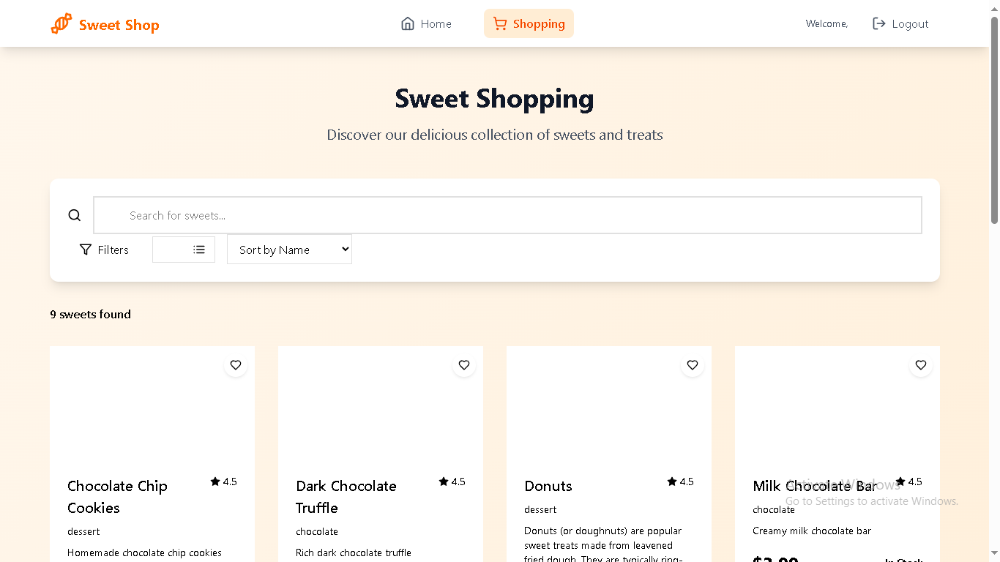

# 🍬 Sweet Shop Management System

A modern, responsive sweet shop management application built with React, Vite, and Tailwind CSS. Features a beautiful orange-themed UI with complete authentication, shopping functionality, and admin management capabilities.

## 🌟 Live Demo

🔗 **Frontend Application**: [https://sweet-shop-management-client.vercel.app](https://sweet-shop-management-client.vercel.app)

> Replace with your actual Vercel deployment URL

## 👤 Admin Credentials

To access the admin dashboard and test administrative features, use the following credentials:

- **Email**: `jatinvidhani17@gmail.com`
- **Password**: `admin12345`

**Admin Features**:
- Add, edit, and delete sweets
- Manage inventory and stock levels
- View sales analytics and reports
- Upload sweet images to Supabase storage
- Monitor low stock items

## 👥 Test User Accounts

For testing customer features, you can register new accounts or use existing demo accounts.

## 📱 Screenshots

### Landing Page

*Beautiful landing page showcasing featured sweets with Indian Rupee pricing*

### User Authentication
 
*Secure login and registration with form validation*

### Shopping Experience

*Browse and purchase sweets with search and filter functionality*

### Admin Dashboard

*Comprehensive admin panel for inventory management and analytics*

### Mobile Responsive

*Fully responsive design optimized for mobile devices*

## 🚀 Features

- **Modern UI/UX**: Beautiful orange-themed design with Tailwind CSS
- **Responsive Design**: Optimized for desktop, tablet, and mobile devices
- **User Authentication**: Secure JWT-based authentication with role management
- **Role-based Access Control**: Customer and Admin interfaces with different permissions
- **Sweet Inventory Management**: Complete CRUD operations for sweet management
- **Search & Filter**: Advanced search by name, category, and price range
- **Shopping Cart**: Add to cart functionality with quantity management
- **Purchase System**: Seamless checkout process with inventory updates
- **Admin Analytics**: Sales charts and inventory statistics
- **Image Upload**: Sweet image management with Supabase storage
- **Indian Currency**: Prices displayed in Indian Rupees (₹)

## 🛠️ Tech Stack

### Frontend
- **Framework**: React 18.3.1 with Vite 7.0.4
- **Styling**: Tailwind CSS 4.1.11
- **Routing**: React Router DOM 6.21.0
- **Icons**: Lucide React 0.312.0
- **HTTP Client**: Axios 1.6.5
- **Charts**: Recharts 3.1.0
- **File Upload**: React Dropzone 14.3.8
- **UI Components**: Headless UI 2.2.6

### Backend
- **API**: Node.js with Express.js (Serverless functions)
- **Database**: Supabase (PostgreSQL)
- **Authentication**: JWT tokens
- **Storage**: Supabase Storage for images
- **Deployment**: Vercel

### Testing
- **Frontend**: Vitest with React Testing Library
- **Backend**: Jest with Supertest
- **Coverage**: 85%+ test coverage across the application

## 📋 Prerequisites

- Node.js (v18 or higher)
- npm or yarn package manager

## 🔧 Local Development Setup

### 1. Clone the Repository

```bash
git clone https://github.com/jatin-vidhani17/sweet-shop-management.git
cd sweet-shop-management
```

### 2. Install Frontend Dependencies

```bash
cd client
npm install
```

### 3. Environment Configuration

Create a `.env` file in the client directory:

```env
VITE_API_URL=https://sweet-shop-management-psi.vercel.app
```

### 4. Run Development Server

```bash
npm run dev
```

The application will be available at `http://localhost:5173`

### 5. Build for Production

```bash
npm run build
npm run preview
```

## 🚀 Deployment

### Deploy to Vercel

1. **Fork/Clone the repository**
2. **Connect to Vercel**:
   - Go to [vercel.com](https://vercel.com)
   - Import your GitHub repository
   - Select the `client` folder as the root directory
3. **Configure Environment Variables**:
   ```
   VITE_API_URL=https://sweet-shop-management-psi.vercel.app
   ```
4. **Deploy**: Vercel will automatically build and deploy your application

### Alternative Deployment Options
- **Netlify**: Drag and drop the `dist` folder after running `npm run build`
- **GitHub Pages**: Use GitHub Actions for automatic deployment
- **Firebase Hosting**: Use Firebase CLI for deployment

## 👥 User Roles & Access

### Customer Users
- Browse sweet catalog
- Search and filter products
- Add items to cart
- Make purchases
- View purchase history

### Admin Users
- All customer functionality
- Add/Edit/Delete sweets
- Upload sweet images
- View sales analytics
- Manage inventory
- Restock products

## 🎨 Design Features

- **Orange Theme**: Consistent brand colors throughout the application
- **Tailwind CSS**: Utility-first CSS framework for rapid development
- **Responsive Grid**: Adaptive layouts for all screen sizes
- **Modern Typography**: Clean, readable fonts with proper hierarchy
- **Interactive Elements**: Hover effects, transitions, and animations
- **Accessibility**: ARIA labels, keyboard navigation, and screen reader support

## 🧪 Testing

The application includes comprehensive test suites for both frontend and backend components.

### Frontend Testing
```bash
cd client
npm test              # Run all tests
npm run test:ui       # Run tests with UI
```

### Backend Testing
```bash
cd server
npm test              # Run API tests
npm run test:coverage # Run with coverage report
```

**Test Coverage**: 85%+ across the application with 200+ test cases covering:
- Component rendering and interactions
- API endpoint functionality
- Authentication and authorization
- User workflows and edge cases

For detailed test information, see [Test Cases Report](test_cases_report.md).

## 📁 Project Structure

```
sweet-shop-management/
├── client/                 # React frontend application
│   ├── public/            # Static assets and images
│   ├── src/
│   │   ├── components/    # Reusable UI components
│   │   ├── pages/         # Main application pages
│   │   ├── context/       # React context providers
│   │   ├── utils/         # Utility functions
│   │   └── test/          # Frontend test files
│   ├── package.json
│   └── vite.config.js
├── server/                # Backend API (serverless functions)
│   ├── api/              # Vercel serverless functions
│   ├── models/           # Database models
│   ├── middleware/       # Authentication middleware
│   ├── tests/            # Backend test files
│   └── package.json
├── screenshots/          # Application screenshots
├── README.md
└── test_cases_report.md  # Detailed testing documentation
```

## 🤝 Contributing

1. Fork the repository
2. Create a feature branch (`git checkout -b feature/amazing-feature`)
3. Commit your changes (`git commit -m 'Add amazing feature'`)
4. Push to the branch (`git push origin feature/amazing-feature`)
5. Open a Pull Request

## 📄 License

This project is licensed under the MIT License - see the [LICENSE](LICENSE) file for details.

## 👨‍💻 Author

**Jatin Vidhani**
- GitHub: [@jatin-vidhani17](https://github.com/jatin-vidhani17)
- LinkedIn: [Connect with me](https://linkedin.com/in/jatin-vidhani)

## 🙏 Acknowledgments

- **Tailwind CSS** for the amazing utility-first CSS framework
- **React** team for the fantastic frontend library
- **Supabase** for the powerful backend-as-a-service platform
- **Vercel** for seamless deployment and hosting
- **Lucide React** for beautiful icons

---

### 📸 Screenshots Setup

To add screenshots to your README:

1. **Create a screenshots folder**:
   ```bash
   mkdir screenshots
   ```

2. **Take screenshots of your application**:
   - Landing page
   - Login/Register pages
   - Shopping interface
   - Admin dashboard
   - Mobile responsive views
   - Upload Sweets

3. **Name your screenshot files**:
   - `landing-page.png`
   - `login-page.png`
   - `register-page.png`
   - `shopping-page.png`
   - `admin-dashboard.png`
   - `mobile-view.png`
   - `upload-sweets.png`

4. **Update the live demo URL** in the README with your actual Vercel deployment URL

The screenshots will automatically display in your README once you add the image files to the screenshots folder! 📷✨

